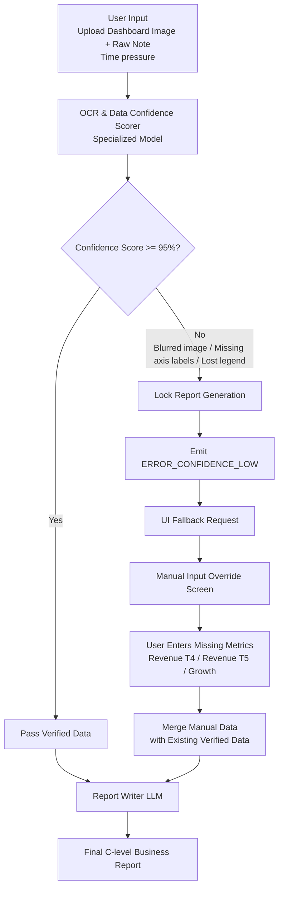
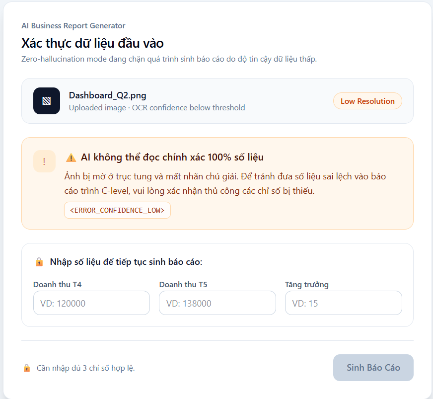

# Day 25 – Track 6: Trình tạo báo cáo kinh doanh

## Thành viên nhóm

| # | Mã học viên | Họ tên đầy đủ |
|---|-------------|---------------|
| 1 | 2A202600138 | Nguyễn Bình Thành |
| 2 | 2A202600486 | Nguyễn Tiến Huy Hoàng |
| 3 | 2A202600260 | Phạm Hoàng Kim Liên |

## Kết quả cuối

- 🎯 [Bộ kiểm thử cuối](./worksheet/01-test-set-review/3-FINAL-test-set-eval-plan.md)
- 🎯 [Thiết kế 3 lớp giải pháp](./worksheet/02-solution-design/1-map-and-format.md) + [artifact/](./worksheet/02-solution-design/artifact/)

---

## 🚀 Giới thiệu kiến trúc an toàn (Zero-Hallucination)

Dự án tập trung xử lý rủi ro AI bịa số liệu (Hallucination) khi nhận đầu vào là các hình ảnh Dashboard kinh doanh bị mờ, thiếu nét hoặc thiếu thông số (Tình huống **T-01**).

### 1. Luồng xử lý định tuyến (Routing Pipeline)
Hệ thống sử dụng Data Confidence Scorer chặn đứng các yêu cầu phân tích nếu độ tin cậy của ảnh dưới 95%, không cho LLM "đoán bừa".

### 2. Giao diện Fallback (Manual Input UI)
Khi phát hiện lỗi hoặc độ tin cậy thấp, hệ thống ngắt luồng và yêu cầu người dùng (Analyst) tự nhập bù thông số thiếu thay vì cố tự điền số ảo vào báo cáo gửi lên C-Level:

