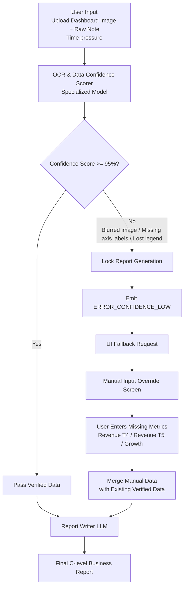

# demo.md — Demo kiến trúc dữ liệu

File này dùng để đặt sơ đồ và mô tả ngắn cách hệ thống giảm rủi ro.

---

## 1. Sơ đồ cách hệ thống xử lý

---

## 2. Thành phần chính

| Thành phần | Nhận gì? | Làm gì? | Trả ra gì? |
|---|---|---|---|
| Môi trường Input (A) | Hình ảnh Dashboard và ghi chú của người dùng | Thu thập dữ liệu thô | Gửi sang phân tích tĩnh |
| OCR Confidence Scorer (B) | Ảnh | Chấm điểm độ tin cậy của việc nhận diện chữ/số | Confidence Score (%) |
| Bộ định tuyến Routing (C) | Điểm % | Rẽ nhánh quy trình (Block rủi ro) | Đi thẳng tới LLM hoặc đá văng ra Fallback |
| Giao diện bù điểm dữ liệu (G) | Yêu cầu lấy thông số thủ công | Chờ người dùng nhập Data | Payload chuẩn để đi vào LLM (D) |

---

## 3. Khi hệ thống gặp vấn đề

| Khi nào lỗi xảy ra? | Hệ thống làm gì? | Người dùng thấy gì? |
|---|---|---|
| Ảnh quá mờ, thiếu chỉ số trục Y | OCR Scorer định giá <95%, chuyển quy trình xuống Fallback | Banner vàng: "Góc ảnh bị mờ. AI không thể đánh giá. Vui lòng nhập thông số thiếu..." |
| LLM từ chối nhưng OCR đọc được | (Ngoại lệ: LLM bị quá cẩn thận do Prompt) | Yêu cầu xác nhận lần 2 |
| File người dùng tải lên không phải là ảnh | OCR Scorer báo lỗi File Format | Thông báo lỗi đỏ: "Vui lòng tải lên định dạng hình ảnh hợp lệ (PNG/JPG)" |

---

## 4. Kiểm tra nhanh

- [x] Sơ đồ không chỉ là “AI trả lời tốt hơn”, mà có bước kiểm tra điểm tin cậy cụ thể (Confidence Scorer).
- [x] Có cách xử lý khi thiếu/mờ dữ liệu (Fallback sang UI).
- [x] Có cách chuyển sang người thật (Manual Input Box).
- [x] Được viết bằng `mermaid` format để hiển thị cấu trúc.
